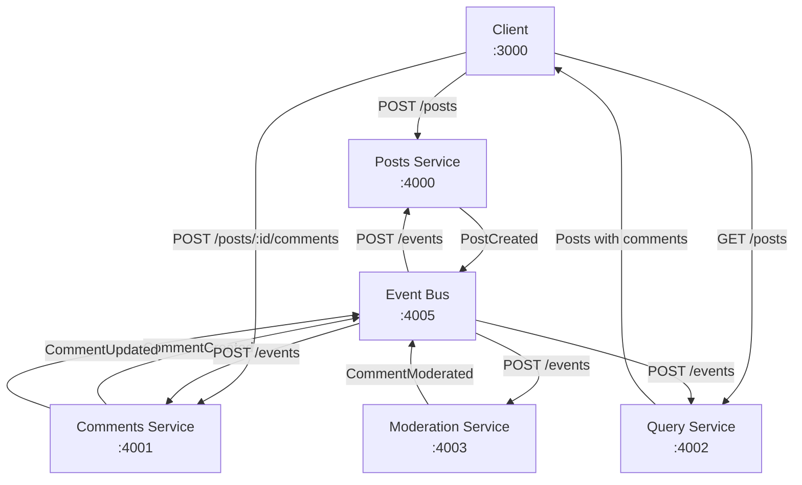
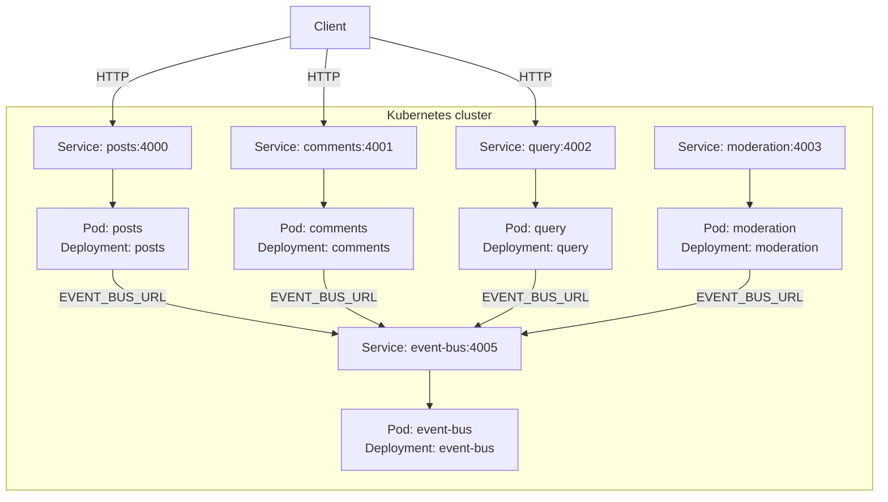

# Mini App Service Architecture

This document describes how the services in this folder communicate. It is based on the current implementation and should be updated when endpoints, events, ports, or data ownership change.

## Services

| Service | Port | Main use | Data owned or returned |
| --- | ---: | --- | --- |
| Client | 3000 | React UI for creating posts and comments and displaying posts | Reads the Query service response; does not own persistent data |
| Posts | 4000 | Creates and stores posts | In-memory `posts` object; publishes `PostCreated` |
| Comments | 4001 | Creates and stores comments for posts | In-memory `commentsByPostId` object; publishes `CommentCreated` and `CommentUpdated` |
| Query | 4002 | Builds a read model containing posts and comments | In-memory `posts` object; returns `GET /posts` |
| Moderation | 4003 | Moderates newly created comments | Approves comments unless their content contains `orange`; publishes `CommentModerated` |
| Event Bus | 4005 | Broadcasts events to all backend services | Does not store data; forwards incoming events |

## Connection Flow



The Event Bus broadcasts every event to Posts, Comments, Query, and Moderation, including the service that originally published it. Each service decides whether to act on the event type.

## Kubernetes Setup

The backend runs as five independent Kubernetes Deployments. Each Deployment has one replica and one container, so each service runs in its own Pod:

| Deployment | Container image | Pod port | Kubernetes Service |
| --- | --- | ---: | --- |
| `posts` | `posts` | 4000 | `posts:4000` |
| `comments` | `comments` | 4001 | `comments:4001` |
| `query` | `query` | 4002 | `query:4002` |
| `moderation` | `moderation` | 4003 | `moderation:4003` |
| `event-bus` | `event-bus` | 4005 | `event-bus:4005` |

The Deployments are defined in `kubernetes/deployment.yaml`, and the internal ClusterIP Services are defined in `kubernetes/services.yaml`. The React client is not included in these manifests.



Kubernetes Services provide stable DNS names and route traffic to the Pods selected by their labels. Backend services use `EVENT_BUS_URL=http://event-bus:4005` in Kubernetes. When started locally with `npm start`, the code defaults to `http://localhost:4005`.

Apply the backend resources with:

```bash
kubectl apply -f kubernetes/deployment.yaml
kubectl apply -f kubernetes/services.yaml
```

## Starting the Application

Use the VS Code Command Palette and run `Tasks: Run Task`, then choose `Start All Services`. This starts the Client, Posts, Comments, Query, Moderation, and Event Bus processes in parallel, with a dedicated terminal panel for each process.

The task configuration is stored in `.vscode/tasks.json`. Stop an individual service by closing its terminal panel, or stop all services from their respective terminal panels.

## Data Flow

### Create a post

1. The Client sends `POST http://localhost:4000/posts` with `{ "title": "..." }`.
2. Posts generates an ID, stores `{ id, title }`, and publishes a `PostCreated` event to the Event Bus.
3. The Event Bus forwards the event to all backend services.
4. Query creates a read-model entry with `{ id, title, comments: [] }`.
5. The Client later requests `GET http://localhost:4002/posts` to display the read model.

### Create and moderate a comment

1. The Client sends `POST http://localhost:4001/posts/:id/comments` with `{ "content": "..." }`.
2. Comments generates an ID, stores the comment with `status: "pending"`, and publishes `CommentCreated`.
3. The Event Bus forwards `CommentCreated` to all backend services.
4. Query appends the comment to the matching post in its read model.
5. Moderation checks the content. It publishes `CommentModerated` with `status: "rejected"` when the content contains `orange`; otherwise it publishes `status: "approved"`.
6. Comments receives `CommentModerated`, attempts to update its stored comment, and publishes `CommentUpdated`.
7. The Client displays the data returned by Query. The current Client only fetches posts once when `PostList` mounts, so new data is not automatically refreshed.

## HTTP Endpoints

| Service | Method | Endpoint | Purpose |
| --- | --- | --- | --- |
| Posts | `GET` | `/posts` | Return all locally stored posts |
| Posts | `POST` | `/posts` | Create a post and publish `PostCreated` |
| Posts | `POST` | `/events` | Receive broadcast events; currently logs them |
| Comments | `GET` | `/posts/:id/comments` | Return comments stored for a post |
| Comments | `POST` | `/posts/:id/comments` | Create a comment and publish `CommentCreated` |
| Comments | `POST` | `/events` | Process `CommentModerated` events |
| Query | `GET` | `/posts` | Return the combined posts-and-comments read model |
| Query | `POST` | `/events` | Process `PostCreated` and `CommentCreated` |
| Moderation | `POST` | `/events` | Process `CommentCreated` and publish moderation result |
| Event Bus | `POST` | `/events` | Broadcast an event to backend services |

## Event Contracts

| Event | Published by | Important data | Current consumers |
| --- | --- | --- | --- |
| `PostCreated` | Posts | `id`, `title` | Query |
| `CommentCreated` | Comments | `id`, `content`, `postId` | Query, Moderation |
| `CommentModerated` | Moderation | Comment data plus `status` | Comments |
| `CommentUpdated` | Comments | Moderation data plus `status` | Query |

All events are sent as JSON with this envelope:

```json
{
  "type": "EventName",
  "data": {}
}
```

## Current Implementation Notes

- All service state is held in memory and is lost when a service restarts, including when a Kubernetes Pod is recreated.
- The Event Bus performs fire-and-forget Axios requests and does not wait for or aggregate delivery results.
- Query handles `PostCreated`, `CommentCreated`, and `CommentUpdated`; it does not process `CommentModerated` directly because Comments publishes the update after applying the moderation result.
- Posts declares `GET /posts` twice. The first handler responds with the posts, making the later empty handler unreachable.
- The Client uses Posts and Comments for writes and Query for reads. It does not use Comments' `GET /posts/:id/comments` endpoint.

## Future Updates

When extending this architecture, update the service table, Mermaid diagram, endpoint table, event contracts, and data-flow steps together. Also record any new persistence layer, retry behavior, event versioning, or service-to-service authentication here.